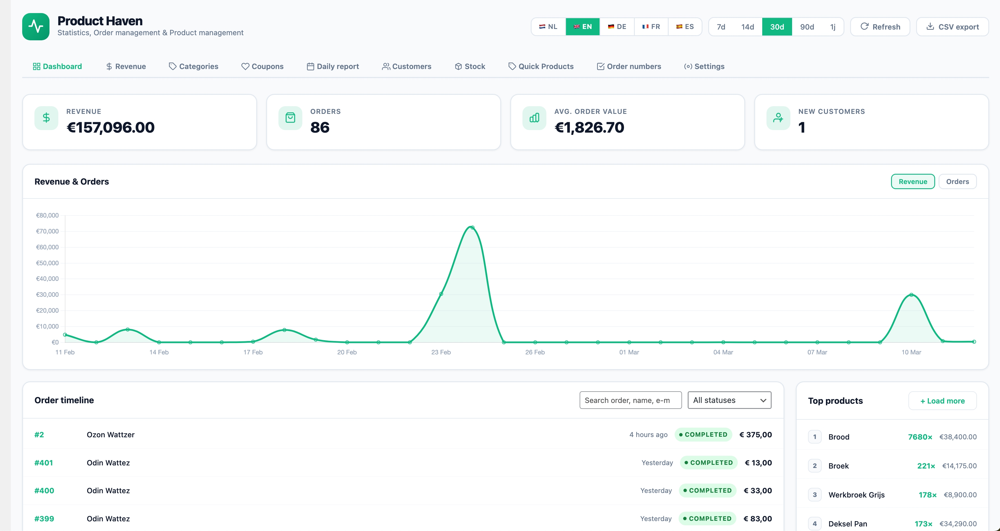

# Product Haven

**Version:** 1.4.0
**Requires:** WordPress 6.0+, WooCommerce 7.0+, PHP 7.4+
**Optional:** Elementor 3.0+ (for frontend widgets)
**License:** GPL-3.0-or-later

---

## Overview

Product Haven is an all-in-one WooCommerce management plugin. It combines a live order dashboard, stock management, a quick product editor, sequential order numbering and Elementor frontend widgets — all in one clean admin interface.



> **Note:** Screenshot contains fake orders and demo data.

This project is also a good fit for a public GitHub release: the code is open source, GPL-licensed, and intended to be useful to store owners and developers who want a practical WooCommerce operations plugin they can inspect, adapt, and extend.

---

## Open Source & GitHub

Product Haven is released as open-source software under the **GPL-3.0-or-later** license.

That means you are free to:

- use the plugin in personal or commercial projects
- study the source code
- modify it to fit your workflow
- redistribute the original or your modified version under the GPL terms

If this project is published on GitHub, contributors, store owners, and developers are welcome to fork it, open issues, and submit improvements.

---

## Support Policy

Product Haven is maintained on a **best-effort** basis.

What that means in practice:

- bug reports and clearly reproducible issues may be reviewed when time allows
- small maintenance updates may be released occasionally
- custom development, store-specific setup, and compatibility work with third-party plugins/themes are not included
- no guaranteed response times or long-term support commitments are promised

If you use Product Haven in production, it is recommended to test updates on a staging site first.

---

## Features

### Order Dashboard

- **Live statistics** — revenue, order count, average order value and new customers for the chosen period (7, 14, 30, 90 days or 1 year)
- **Interactive Chart.js graph** — revenue and orders on the same timeline, toggle per dataset
- **Order timeline** — searchable, filterable by status, paginated
- **Order modal** — full order detail overlay with customer info, product list and notes; add notes directly from the modal
- **Customer card** — slide-in panel with order statistics and full order history per customer
- **Top products** — best-selling products for the chosen period
- **CSV export** — configurable columns, filtered by current period and status

### Stock Management

- Low-stock overview with configurable threshold
- Bulk stock updates with reason logging
- Email alerts for low stock and out-of-stock products (real-time and daily digest)
- CSV export of full stock overview

### Quick Products

- Create and edit simple WooCommerce products directly from the dashboard
- Duplicate, quick-edit and delete products without leaving the page
- Media library integration for product images

### Sequential Order Numbers

- Clean sequential order numbers independent of WordPress post IDs
- Configurable prefix, suffix, padding and start number
- Orders remain searchable by sequential number in WooCommerce admin
- Thread-safe counter using database locks

### Frontend (Elementor)

- **Stats Widget** — displays revenue, order count and average order value for the logged-in customer
- **Timeline Widget** — paginated order timeline for the logged-in customer with status badges and product list

### REST API (optional)

Activate via Settings → Enable REST API.

| Method | Endpoint                                                    | Description    |
| ------ | ----------------------------------------------------------- | -------------- |
| GET    | `/wp-json/product-haven/v1/stats?days=30`                 | Statistics     |
| GET    | `/wp-json/product-haven/v1/timeline?page=1&per_page=20`   | Order timeline |
| GET    | `/wp-json/product-haven/v1/top-products?days=30&limit=10` | Top products   |

All endpoints require the `manage_woocommerce` capability.

---

## File Structure

```
product-haven/
├── product-haven.php               # Main bootstrap
├── uninstall.php                   # Cleanup on delete
├── readme.txt                      # WordPress.org readme
├── CHANGELOG.md                    # Version history
├── CONTRIBUTING.md                 # Contribution guidelines
├── ROADMAP.md                      # Planned features
├── SECURITY.md                     # Security policy
├── LICENSE                         # GPL-3.0-or-later
├── phpcs.xml                       # PHP CodeSniffer config
├── .gitignore
├── includes/
│   ├── i18n.php                    # Translations (NL / EN / DE / FR / ES)
│   ├── data.php                    # Data layer (queries, formatting, CSV)
│   ├── ajax.php                    # AJAX handlers (lazy loaded)
│   ├── sequential-orders.php       # Sequential order number logic
│   ├── quick-products.php          # Quick Products AJAX handlers
│   ├── admin/
│   │   ├── admin-page.php          # Menu registration + settings save
│   │   └── settings-page.php       # Admin HTML
│   ├── api/
│   │   └── rest-api.php            # Optional REST API
│   ├── partials/
│   │   ├── sequential-orders-tab.php
│   │   └── quick-products-tab.php
│   └── widgets/
│       ├── stats-widget.php        # Elementor Stats Widget
│       └── timeline-widget.php     # Elementor Timeline Widget
├── languages/                      # Translation files (.po / .mo)
└── assets/
    ├── images/
    │   └── product-haven-dashboard.jpg
    ├── css/
    │   ├── ph-admin.css            # Admin styles
    │   ├── ph-front.css            # Frontend widget styles
    │   └── sequential-orders.css   # Sequential orders tab styles
    └── js/
        ├── ph-admin.js             # Admin JavaScript
        ├── ph-front.js             # Frontend JavaScript
        ├── sequential-orders.js    # Sequential orders tab JavaScript
        └── vendor/
            └── chart.umd.min.js    # Bundled Chart.js (no CDN dependency)
```

---

## Installation

1. Upload the `product-haven` folder to `/wp-content/plugins/`
2. Activate via **Plugins → Installed Plugins**
3. WooCommerce must be installed and active
4. Navigate to **Product Haven** in the WordPress admin menu

---

## Local Development

For local development, place the plugin in a WordPress installation at:

`/wp-content/plugins/product-haven/`

Recommended local setup:

- WordPress 6.0+
- WooCommerce 7.0+
- PHP 7.4+
- Elementor 3.0+ only if you want to test the frontend widgets

Before opening a pull request, it is a good idea to:

- test the main admin flows manually
- verify WooCommerce activation and fallback behaviour
- check that AJAX actions still work correctly for authenticated users
- confirm there are no new PHP notices, warnings, or fatal errors

---

## Issues

If you find a bug, please open an issue with:

- a short summary of the problem
- clear reproduction steps
- your WordPress, WooCommerce, and PHP versions
- screenshots or error messages when relevant

Feature ideas are welcome, but not all requests will be implemented.

---

## Contributing

Contributions are welcome, especially for:

- bug fixes
- performance improvements
- security hardening
- documentation improvements
- compatibility updates for newer WordPress or WooCommerce releases

Please try to keep pull requests focused and easy to review.

---

## Settings

Open the dashboard and click **⚙ Settings** to expand the settings panel:

| Setting                  | Default     | Description                        |
| ------------------------ | ----------- | ---------------------------------- |
| Default period           | 30 days     | Active period on load              |
| Chart type               | Line        | Line or bar chart                  |
| Show average order value | On          | Show/hide stat card                |
| Show top products        | On          | Show/hide block                    |
| Orders per page          | 20          | Timeline pagination                |
| Accent colour            | `#10B981` | Customisable brand colour          |
| Export columns           | All         | Choose which columns appear in CSV |
| Enable REST API          | Off         | Activate REST endpoints            |

---

## Performance

- Statistics are cached for 15 minutes via WordPress transients
- Chart data is cached for 15 minutes
- Top products are cached for 30 minutes
- Cache is automatically cleared when settings are saved
- AJAX handlers are lazy loaded — `ajax.php` is only included when an AJAX request comes in

---

## Security

- All admin AJAX requests require nonce (`ph_admin_nonce`) + `manage_woocommerce` capability
- All frontend AJAX requests require nonce (`ph_front_nonce`) + logged-in user
- Unauthenticated visitors receive HTTP 401 on frontend endpoints
- REST API requires `manage_woocommerce` (no public access)
- CSV export streams via PHP output — no temporary files written to disk

If you discover a security issue, please avoid posting full exploit details in a public issue before there is time to review and fix it.

---

## Disclaimer

Product Haven is provided **as is**, without any warranty. While the plugin is intended to be maintained when possible, updates, fixes, and review of issues are not guaranteed on a fixed schedule.

---

## Changelog

All notable changes to this project are documented here.
Format follows [Keep a Changelog](https://keepachangelog.com/en/1.0.0/).
Versions follow [Semantic Versioning](https://semver.org/).

---

### [Unreleased]

---

### [1.4.0] — 2026-03-25

#### Changed

- **Translate UI copy to English** — Converted Dutch comments/labels to English across admin/front/sequential CSS and JS, standardized UI copy strings and comments, and updated admin PHP comments. No functional logic changes.
- **Portuguese and Italian language buttons** — Added PT and IT to the settings page language switcher; now supports 7 languages: NL, EN, DE, FR, ES, PT, IT.
- **Code comments and formatting cleanup** — Simplified inline comments and section dividers across JS/PHP/CSS, removed end-of-block HTML comments from admin partials, minor whitespace tweaks. No functional changes.
- **i18n translation array formatting** — Normalized spacing and column alignment in `includes/i18n.php`. No keys or values were modified.
- **UX clarity pass** — Replaced all remaining Dutch fallback strings in `ph-admin.js` with English equivalents. Fixed `aria-label="Sluiten"` on modal close buttons to `aria-label="Close"`. Changed period selector label `1j` → `1y` in `settings-page.php`.

#### Documentation

- README and readme.txt updated; multilingual feature description expanded for PT and IT.
- Roadmap updated; two items (screenshots, UX clarity pass) carried forward to v1.5.

---

### [1.3.3] — 2026-03-19

#### Changed

- **Translate UI copy to English** — Converted Dutch comments/labels to English across admin/front/sequential CSS and JS, standardized UI copy strings and comments, and updated admin PHP comments. No functional logic changes.
- **Added Portuguese and Italian language buttons** — Added PT and IT language buttons to the settings page.

---

### [1.3.2] — 2026-03-12

#### Changed

- **Quick Products — action button tooltips** — the 4 row-action buttons (Edit, Duplicate, Open in WC, Delete) now show a styled CSS tooltip on hover; more reliable than native `title` tooltips.
- **Quick Products — "New product" button** — added bottom margin so it no longer sits flush against the filter bar.
- **Quick Products — Publish card** — sidebar card body now uses flexbox gap for proper spacing between Status, Visibility, and Featured toggle fields.

---

### [1.3.1] — 2026-03-12

#### Changed

- **Revenue tab** — container centred with flexbox; padding `28px 32px`; table gets `max-width:560px`, subtle box-shadow, and larger row padding.
- **Categories tab header** — column headers moved into card-header (`mos-categories-col-header`), matching the coupons pattern; `#F8FAFC` background, `#64748B` text.
- **Customers tab header** — column headers moved into card-header (`mos-customers-col-header`); inline `mos-report-header` row removed; same light styling as coupons/categories.
- **Daily report** — `mos-daily-date-wrap` gets `margin-top:12px` and `margin-bottom:6px` for tighter spacing.
- **Stock reminder email** — header gradient and CTA button now reflect the most severe stock status: red for out-of-stock, amber for low stock, green for test/no-alert emails. Stock count numbers coloured to match.

---

### [1.3.0] — 2026-03-12

#### Added

- **French (FR) and Spanish (ES) translations** — all UI strings in `i18n.php` now have complete `fr` and `es` entries across every section:

  - General / Header
  - Tabs
  - Stat cards
  - Dashboard chart
  - Order timeline
  - Top products
  - Low stock card
  - Delete / refund / revert modals
  - Stock edit modal (old + new)
  - Settings tab
  - Customer card modal
  - Order detail + edit modal
  - JS general strings (errors, loading states)
  - JS: low stock card
  - JS: chart
  - JS: timeline / time-ago strings
  - JS: order modal (all actions, status buttons, danger zone)
  - JS: order edit modal
  - JS: refund + revert modals
  - JS: delete confirmation
  - JS: customer card
  - JS: revenue report
  - JS: categories report
  - JS: coupons report
  - JS: daily report
  - JS: customers report
  - JS: stock table + settings + bulk actions
  - JS: Quick Products (all list, editor, filters, fields, image/gallery)
  - JS: stockEdit (dashboard low stock modal)
  - Sequential Orders tab
  - WooCommerce order statuses
  - CSV export columns
- **German (DE) translations** — all entries that were missing `de` are now complete (same sections as above).
- **Language switcher extended** — the header now shows **5 language buttons**: NL · EN · DE · FR · ES.

  - Each button has a localized `title` tooltip (e.g. "Switch to French").
  - New i18n keys: `lang_de`, `lang_fr`, `lang_es`, `switch_to_de`, `switch_to_fr`, `switch_to_es`.
- **AJAX language handler** (`ph_set_lang`) now accepts `de`, `fr` and `es` in addition to `nl` and `en`. Previously selecting DE/FR/ES would silently fall back to `nl`.
- **Locale mapping** — `locale` passed to JS is now correctly set per language:

  - `nl` → `nl-NL`
  - `en` → `en-GB`
  - `de` → `de-DE`
  - `fr` → `fr-FR`
  - `es` → `es-ES`

#### Fixed

- Broken flag emoji characters (🇫🇷 / 🇪🇸) that rendered as replacement boxes on some server encodings — replaced with working emoji characters for all language buttons.

#### Changed

- Language switcher `title` attribute moved from the wrapping `<div>` to individual `<button>` elements, so each button describes its own action.

---

### [1.2.0] — 2026-03-11

#### Added

- **In-plugin order edit modal** — replaced the "Bewerken in WC" external link with an own modal inside the plugin.
  - 10 billing fields: voornaam, achternaam, bedrijf, e-mail, telefoon, adres 1, adres 2, stad, postcode, land.
  - Optioneel intern notitieveld dat als ordernotitie wordt opgeslagen na het bewaren.
  - Foutmelding-paragraaf en save-knop met laad-indicator.
  - Knop `#mos-modal-edit-btn` in de order modal header vervangt de oude `<a>`-link.
- **`ph_ajax_qp_save_order()` (ajax.php)** — nieuwe AJAX handler die billing-velden opslaat via WC setters, optioneel een interne ordernotitie toevoegt, WP/WC caches leegt en een verse `ph_format_order()` teruggeeft.
- **`ph_format_order()` uitgebreid (data.php)** — het `customer`-object bevat nu alle billing-adresvelden:
  `first_name`, `last_name`, `company`, `phone`, `address_1`, `address_2`, `postcode` (naast de al bestaande `name`, `email`, `city`, `country`, `id`).
- **Order modal toont nu** telefoon en volledig adres (adres 1, adres 2, postcode, stad, land).
- **`openOrderEditModal(o)` (ph-admin.js)** — nieuwe JS-functie die de edit modal opent, velden vult vanuit `o.customer.*`, save/cancel/close listeners beheert via klonen en na opslaan de cache en modal live bijwerkt.
- **`openOrderModal()` heeft nu een `forceReload`-parameter** — vanuit de klantenkaart wordt altijd `forceReload=true` meegegeven zodat order-data nooit uit een mogelijk verouderde cache komt.

#### Fixed

- **Order edit modal toonde oude data bij heropenen** — na opslaan wordt de `orderCache` bijgewerkt, de modal body herrenderd en de editBtn opnieuw gebonden aan de verse data.
- **Verkeerde stad/adres bij orders geopend vanuit klantenkaart** — `openOrderModal` sloeg een order op in `orderCache` vanuit de tijdlijn; bij een volgende open vanuit de klantenkaart werd de gecachede (mogelijk verouderde) versie getoond. Opgelost via `forceReload=true` en het legen van WP/WC caches in `ph_ajax_get_single_order`.
- **`ph_ajax_get_single_order` legt nu WP object-cache en WC transients** — `clean_post_cache()` + `wc_delete_shop_order_transients()` voor het ophalen, zodat altijd actuele order-data wordt gelezen.

#### Changed

- `mos-modal-edit-link` CSS uitgebreid met `background:none; border:none; cursor:pointer; padding:0` zodat het element als knop werkt.
- Nieuwe CSS-klassen: `.mos-order-edit-modal`, `.mos-order-edit-grid` (2-koloms grid), `.mos-order-edit-field`, `.mos-order-edit-footer`; backdrop `#mos-order-edit-backdrop` toegevoegd aan de `[hidden]`-suppressieblok.

---

### [1.1.0] — 2026-03-10

#### Added

- **Voorraad-tab** — volledige Stock Sentinel-functionaliteit geïntegreerd in Product Haven als eigen "Voorraad" tab in de zijbalk.
  - Overzichtstabel met zoeken, filteren (alle / laag / uitverkocht), sorteren en paginering.
  - Statkaarten: totale producten, totale voorraadwaarde, laag op voorraad, uitverkocht.
  - Inline voorraad bewerken via een eigen edit-modal (hoeveelheid + reden).
  - Bulk-update: meerdere producten tegelijk bijwerken.
  - CSV-export van de volledige voorraadlijst.
  - Instellingenpaneel: drempelwaarde, alert-e-mailadres, realtime alerts aan/uit, dagelijkse digest aan/uit.
  - Testknop om direct een alert-e-mail te versturen.
- **Realtime e-mailalerts** — `woocommerce_product_set_stock` en `woocommerce_variation_set_stock` hooks sturen een alert wanneer een product onder de drempel of uitverkocht raakt.
  - Backup-hook `woocommerce_product_set_stock_status` vangt statuswijzigingen op die de kwantiteits-hook missen.
  - 30-minuten cooldown per product (via transient) voorkomt spam bij meerdere orders.
- **Dagelijkse digest-cron** — `ph_stock_daily_alert` cron stuurt elke dag een overzichts-e-mail van alle lage/uitverkochte producten (instelbaar).
- **DB-logtabel** `{prefix}ph_stock_log` — elke voorraadwijziging wordt gelogd (product, oud/nieuw aantal, reden, tijdstip).
- **WooCommerce eigen stock-mails uitgeschakeld** — `woocommerce_email_enabled_low_stock` en `woocommerce_email_enabled_no_stock` gefilterd naar `false`; Product Haven stuurt zelf de meldingen.
- **`wc_update_product_stock()`** gebruikt voor voorraadwijzigingen zodat alle WC-hooks correct vuren.
- Added Quick Products tab — create and edit products directly from the dashboard
- Added Sequential Order Numbers tab — clean sequential numbering with prefix/suffix support
- Full rebrand to Product Haven

#### Fixed

- **Operator-precedence bug** in de alertcontrole (`$opts['key'] ?? '1' !== '1'` evalueerde verkeerd) — opgelost met extra haakjes.
- **`require_once` stond ná een vroegtijdige `return`** — verplaatst naar vóór alle controles zodat helperfuncties altijd beschikbaar zijn.
- **Refresh-knop vernieuwe de Voorraad-tab niet** — `loadStock()` wordt nu ook aangeroepen vanuit de refresh-handler als de Voorraad-tab actief is.
- **Settings- en edit-popup waren traag** — `backdrop-filter: blur()` verwijderd uit de CSS (GPU-zwaar); vervangen door `rgba`-achtergrond zonder blur.

#### Changed

- Plugin-naam in de WordPress-zijbalk gewijzigd van `OrderSync` naar `Order Pulse` (nu: **Product Haven**).
- Voorraadupdate gebruikt `wc_update_product_stock()` in plaats van `set_stock_quantity()/save()` voor correcte hook-triggering.

---

### [1.0.0]

- Initial release

---

## License

GPL-3.0-or-later — https://www.gnu.org/licenses/gpl-3.0.html
